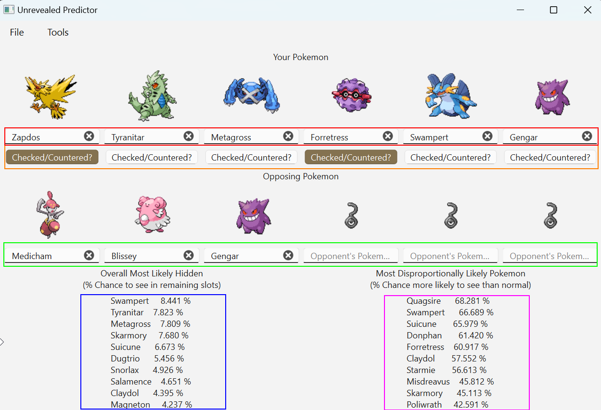

# Smogon Unrevealed Predictor

## Table of Contents
1. [General Overview](#general-overview)
2. [Installation](#installation)
3. [Usage](#usage)
4. [Theory](#theory)
5. [Limitations](#limitations)
6. [I Want to help](#i-want-to-help)
7. [Acknowledgments](#acknowledgements)

## General Overview
The goal of this code is to develop a system for predicting unrevealed pokemon on the opponent’s side in non team preview Smogon singles formats. The system also handles automatically gathering the relevant data and storing it locally.

## Installation
### Windows Executable Installation
The unrevealed_predictor.zip file contains a Windows .exe file (and also a data folder). You should be able to unzip that folder on any 64-bit Windows computer and run the code by double clicking on unrevealed_predictor.exe.

It's my understanding that Windows Defender will often block .exe files created with pyinstaller because some people create viruses using that package and so all executables produced this way have elements that look like known viruses. Scouts honor that I didn't design this to do anything malicious (and am only using well established libraries which also shouldn't do anything malicous). 

Due to the limitations of the pyinstaller package (and the fact that I only have one computer) I cannot create executable files for other operating systems.

### Open Source Installation
This source code can be downloaded and run via the command line. There are 3 Python libraries required (listed in the requirements.txt file). This code was developed on (and so far has only been tested with) Python 3.12 on a Windows device.

## Usage
Upon first running the program you will be prompted to input your selected format. Once you have done that you will be brought into the main working area (shown below). 

### Your Pokemon Input (Red)
In this section you input the names of your pokemon. All textboxes are configured to show you a dropdown of usable options. If a pokemon is not listed that means they are either invalid in the given format or were not used enough in the most recent monthly stats upload to have an impact. They can be entered to see their image but marking them as checked/countered will give an invalid pokemon warning.

### Your Pokemon Checked/Countered (Orange)
How your opponent's pokemon has reacted to yours indicates what they have on their team. When you feel that your opponent has seen and sufficiently reacted to a pokemon you have on the field (i.e. you don't believe they have a better check/counter waiting in the back) then click this button. In the example above, the opponent has reacted to Zapdos and Forretress. Moltres is a great Forretress counter in Gen3 OU so having not seen a Moltres by this point makes it less likely one is hiding in the back. Note that, if you mark as checked/countered a pokemon without usage data in the dataset (due to being illegal in the given format or simply not having enough usage) you will get an "Invalid Pokemon Present" warning until you unmark them.

### Opponents Pokemon (Green)
Below your pokemon there are places to input the names of the opponents pokemon that have been revealed so far. As with your pokemon, all textboxes are configured to show usable options. Manually typing in the name of another pokemon will show its image but give an "Invalid Pokemon Present" warning until it is cleared. As invalid pokemon do not have data to adjust the model, removing them will not change the outputs in any way.

### Overall Most Likely Hidden (Blue)
This section shows the top 10 pokemon which are most likely to be remaining on the opponents team. It heavily weighs pokemon that appear often in the metagame. The percentage displayed is the assumed likelihood of seeing the given pokemon.

### Disproportionally Most Likely Hidden (Purple)
This section shows the top 10 pokemon which are most likely to be seen when over their default usage. It allows you to see pokemon that are unlikely in the overall metagame but when they are seen it's with a team composition like the opponent's. The percentage displayed is the percent likelihood to see that pokemon more than default.

### File Menu
#### Clear Opponent (Ctrl+C)
This command will clear the 6 pokemon on the opponent's side of the field. It is useful for getting ready to play a new game with the same team.
#### Reset (Ctrl+R)
This command will clear all 12 pokemon entry fields.
#### Quit (Ctrl+Q)
This command will exit the GUI.

### Tools Menu
#### Select Format
This command will bring up the format selection dialog, allowing you to select a new format. The dialog contains 3 options: generation, tier, and Minimum ELO Cutoff. Each box contains all the unique options for that field, meaning there are some invalid combinations. If an invalid combination is selected the program will warn you about it and you'll need to select a valid format.

#### Refresh Data
The Smogon team releases new stats every month. Selecting this option will check if new data has been added and what formats are available. It will also delete any existing format data so that it can be replaced by newer data upon format selection.

#### Set Default Format
This command will save a text file with information on your currently selected format. When the code is run in the future the text file will be read and the format selection dialog will not be required during startup. If a default format has previously been selected it will be overwritten.

#### Delete Default Format
This command deletes the default format text file so that the format selection dialog will pop up during startup again.

## Theory
Some of this section uses statistical notation of the form P(A |B & C). This represents the probability of A occurring given that B and C have occurred.
### Teammate Correlation
The primary calculation engine of this project relies on the pairwise teammate data from Pokemon Showdown published by Smogon. Each pokemon in a metagame has a spread of possible teammates. How often those two pokemon are on the field together is calculated and reported out.

For a simple example assume in a month a given metagame was played 100 times. Pokemon A which was seen in 50 matches and pokemon B was seen in 15 matches, in 10 matches both were seen. That gives us P(A) = 0.5, P(B) = 0.15, P(A|B) = P(A&B)/P(B) = 0.1/0.15 = 0.666, and P(B|A) = P(B&A)/P(B) = 0.1/0.5 = 0.2.

The data available consists only of pairwise correlations so if we add a pokemon C (seen 20 times, 10 with A and 2 with B) then we make the assumption that P(C|A&B) = (P(C|A) + P(C|B)) / 2. As explained [later](#non-independence-of-teammate-correlations) this assumption is almost definitely invalid. However, to get an accurate value we'd need to know P(A&B&C) which is data not currently published.

Technically, the divisor above is not actually 2 but actually (2-P(A|B)-P(B|A)) because the system knows not to recommend pokemon that have already been seen (as there is a species clause on Smogon).

### Lead Pokemon Adjustment
All non-team preview generations have a fixed lead for each team. There are some pokemon who are disproportionately seen in the lead pokemon slot. If pokemon A is seen in the lead slot 60% of the time and pokemon B is teammates with A 30% of the time, we make the assumption that that 30% is independent of A's lead status. Therefore, while P(A|B) = 0.3, P(A|B & A_not_lead) which is what we use is equal to 0.3 * (1-0.6) or 0.12.

### Checks and Counters Adjustment
The checks and counters adjustment relies on the idea that in most cases your opponent will attempt to check your pokemon with the most effective check/counter they have on their team. Therefore, any pokemon who would be a better counter to yours are unlikely to remain hidden on the opponents team. In the data, each pokemon has a pairwise check/counter score functionally a proportion of the time pokemon A is KO'ed or forced to switch out by pokemon B. The formula for this section looks something like P(C|B & A_checked) = P(C|B) * 1-min(0, C_checks_A - B_checks_A).

For example the check/counter data for Zapdos in Gen3 OU could look in part like

|Opposing Pokemon | Check/Counter Score |
|-----------------|---------------------|
|Regice           |94.1                 |
|Blissey          |91.2                 |
|Regirock         |87.0                 |
|Tyranitar        |74.5                 |
|Snorlax          |77.2                 |
|Swampert         |43.0                 |
|Skarmory         |11.2                 |
|Milotic          |7.2                  |

Imagine you have revealed a Zapdos and your opponent has revealed Regirock, Skarmory, and Swampert. If you mark Zapdos as checked, the code assumes the check was with the most effective pokemon, Regirock. The code would then derate the likelihood of seeing Regice by 7.1% (94.1-87.0), derate Blissey by 4.2% (91.2-87.0), and not adjust the likelihood of Tyranitar, Snorlax, or Milotic (as they are less effective checks than Regirock).

## Limitations
### Non-Independence of Teammate Correlations
One of the primary assumptions of this code is that each pokemon on the opponents team contributes independent information about the likely composition of the remaining team mates. Due to the nature of the underlying data source we only have information on pairwise combinations of pokemon.

Imagine a metagame where it was important to have 2 of 3 pokemon filling a given niche on any given team, any combination of those 3 (A+B, A+C, or B+C) would work, but all 3 (A+B+C) would be detrimental. If your opponent has already revealed A and C this code would see a high correlation between A and B as well as a high correlation between C and B and therefore conclude that B was a likely hidden teammate. However, a model with better data would understand that A+B+C is uncommon even though A+B and B+C are both common and adjust accordingly.

Similarly, the lead information is very simplistic. A pokemon who is in the lead slot 60% of the time likely does not have the same partners when it's in the lead slot as when it's in the rear slots.

### Lack of Information on Battle Context
Overall I don't expect this tool to be a replacement for game knowledge. I hope it will likely help newer players learn a metagame but it is simply incapable of understanding the context an experienced player brings to the table. Below are a few examples of where that may come into play.

#### Versatile Pokemon 
Many pokemon have versatile roles they can play which impact their likely teammates. For example, in Gen3 OU Forretress really appreciates having Tyranitar with Pursuit as a teammate. Therefore, seeing a non-pursuit Tyranitar likely indicates there is not a Forretress, and if you see both non-pursuit Tyranitar and Forretress an alternate pursuit user like Umbreon or Houndoom is incredibly likely. This system does not understand that context and treats all Tyranitars the same regardless of moveset.

Versatile pokemon on your side of the field may also affect the checks and counters adjustment. Consider a pokemon choice locked into a given move. Depending on the move selected, the best check on the opponent's side may be a pokemon who isn't typically considered a check to yours. Marking the "Checked/Countered" box will then erroneously suggest that more typical checks are unlikely to be seen.

#### Pokemon with Niche Roles
Due to the pairwise nature of the correlations, this code cannot consider holes in the opponent's team as currently revealed and is unlikely to suggest niche pokemon that could effectively fill that hole.

#### Positioning
Aside from the lead position, this code cannot account for reveal order. Certain pokemon mostly fill the role of late-game sweeper and so are likely to be hidden until the end game if at all possible.

### Data Delay
The data used by this project is calculated/released monthly. Therefore, in the case of major metagame shifts (most obviously bans) suggestions may not be reasonable until a month has passed.

## I Want to Help
If you like to code please feel free to send a pull request my way! I'll also consider working on issues posted in the GitHub issue tracker.

## Acknowledgements
Sprite images are property of The Pokemon Company.
[Sprite](https://veekun.com/dex/downloads) and [Pokedex](https://github.com/veekun/pokedex) data was assembled by veekun.
This project would not be possible without the work done to [calculate](https://github.com/smogon/usage-stats) and [host](https://www.smogon.com/stats/) usage stats from Pokemon Showdown.